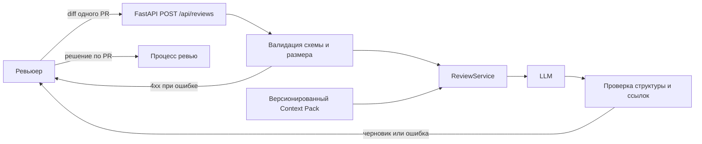

# ADR-001: человек подтверждает черновик AI-ревью

- Статус: proposed
- Дата: 2026-09-20
- Ответственные: владелец учебного проекта и ревьюер PR; конкретные люди не назначены

## Контекст

Учебный [diff](TRAINING_PR.diff) добавляет POST /api/reviews: API берёт payload["diff"], а сервис отправляет текст модели и возвращает неструктурированный comment. В таком виде отсутствующий diff приводит к исключению; формат доказательств и действия AI не ограничены контрактом. Нужен первый сценарий, в котором человек получает проверяемый черновик и сохраняет решение.

## Решение

Для будущего прототипа принять синхронный поток: API валидирует обязательный непустой текстовый diff и ограничивает размер; сервис добавляет версионированный master prompt/Context Pack; LLM генерирует черновик; проверка результата оставляет не больше трёх рисков и требует существующую в diff ссылку на файл и строку; человек просматривает результат. API не содержит операций approve, merge и изменения кода. Ошибки модели и невалидный результат возвращаются как ошибки/неопределённость, а не как успешное ревью. Конкретные HTTP-коды для сбоя модели и лимит размера утвердить до реализации.

Это **проектное решение**, а не описание существующего кода. Автоматическая проверка ссылки подтверждает лишь наличие строки в diff; причинную достоверность проверяет человек.

## Рассмотренные альтернативы

| Альтернатива | Почему не выбрали сейчас |
|---|---|
| Только ручное ревью | Не позволяет проверить гипотезу об экономии времени первого прохода |
| Автоматическая публикация комментариев и merge | Выходит за границы учебного кейса и убирает проверку человеком |
| Возвращать сырой текст LLM без схемы | Нельзя надёжно проверить число рисков, ссылки и воспроизводимость |

## Последствия и главный риск

- Положительное: проверяемый формат ответа, ясные границы AI, тестируемые ошибки входа.
- Ограничение: задержка и стоимость LLM; качество зависит от модели и контекста; ссылка на строку не гарантирует правильность вывода.
- Главный риск: правдоподобное, но ложное замечание либо инструкция, внедрённая внутрь diff.
- Проверка риска: набор diff с известными дефектами и ложными приманками; два независимых ревьюера оценивают риски, ссылки и доказательства.

## Архитектурная схема

## Как использовали AI

- Для чего: предложить архитектурное решение и оценить его риск.
- Тип промпта: master prompting; [P1-03](prompts.md#журнал).
- Проверка: отличены факты diff от будущего решения; схема соответствует процессу TO BE. Статус proposed до согласования человеком.
