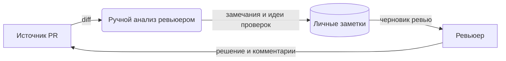
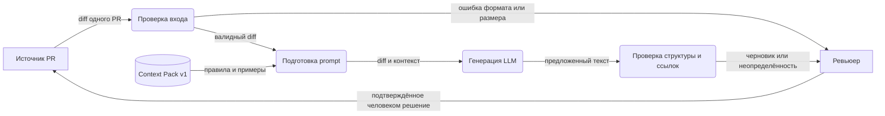

# Анализ процесса: AS IS и TO BE

Нотация — **DFD уровня 1**, изображённая Mermaid: прямоугольники обозначают внешних участников/источники, скруглённые блоки — процессы, цилиндр — хранилище; подписи стрелок — данные. AS IS — гипотеза для учебного кейса, поскольку реальный процесс команды не предоставлен.

## AS IS

Человек вручную связывает замечание с кодом и придумывает проверку. Время и частота потери информации не измерены. Риск процесса — замечание без воспроизводимого доказательства.

## TO BE

Человек передаёт diff и получает описание изменения, до трёх доказанных рисков и проверки. Сервис возвращает ошибки некорректного ввода и сбоя модели. Автоматическая проверка ссылки подтверждает лишь наличие файла и строки в diff; причинный вывод подтверждает ревьюер.

## Разница

| Что меняется | AS IS | TO BE | Как проверим изменение |
|---|---|---|---|
| Первый проход | Полностью ручной | AI готовит черновик | Парное измерение времени до полезного замечания |
| Доказательства | Формат зависит от автора | Файл, строка, наблюдение, проверка | Разметка замечаний двумя ревьюерами |
| Ошибка входа | Не описана | Валидатор возвращает 4xx до LLM | Integration/E2E для пустого и неверного diff |
| Решение | Человек | Человек | Аудит действий: никаких approve/merge/edit |

## Как использовали AI

- Для чего: описать учебный процесс и потоки данных в DFD.
- Тип промпта: master prompting; [P1-03](prompts.md#журнал).
- Проверка: AS IS обозначен как гипотеза, TO BE согласован с [ADR](adr.md); оценка студента ожидается.
