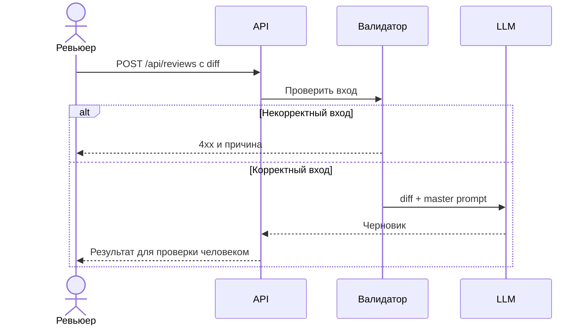

# Use cases и user stories

## Первый рабочий сценарий

**Когда** ревьюер отправляет diff одного PR, **система** проверяет вход и создаёт черновик ревью, **а пользователь получает** описание изменения, до трёх доказанных рисков и рекомендуемые проверки. Решение по PR остаётся у ревьюера.

Не входит: публикация комментариев в GitHub, автоматический approve/merge, изменение кода и анализ файлов вне diff.

## Use case UC-1: получить черновик ревью

| Поле | Значение |
|---|---|
| Актор | Ревьюер PR |
| Триггер | Отправка diff через POST /api/reviews |
| Предусловия | Текстовый diff одного PR в допустимом размере; сервис и модель доступны |
| Основной результат | Черновик с изменением, 0–3 рисками и проверками, который человек подтверждает или отклоняет |
| Ошибка или отказ | Отсутствующее/нестроковое/пустое поле diff → 4xx без вызова LLM; сбой LLM → контролируемая ошибка без выдуманного ревью |



## User stories и acceptance criteria

- Как ревьюер, я хочу видеть краткое описание изменения, чтобы понять его смысл до чтения деталей.
- Как ревьюер, я хочу видеть только замечания с местом и доказательством, чтобы быстро проверить их.
- Как ревьюер, я хочу получить понятную ошибку при неверном вводе, чтобы исправить запрос.

```gherkin
Feature: Черновик ревью одного PR

  Scenario: Корректный учебный diff
    Given доступен сервис и текст TRAINING_PR.diff
    When ревьюер отправляет diff на POST /api/reviews
    Then он получает описание изменения и не более трёх рисков
    And каждый риск содержит файл, строку и проверяемое наблюдение
    And сервис не выполняет approve, merge или изменение кода

  Scenario: Поле diff отсутствует
    Given доступен сервис
    When ревьюер отправляет пустой JSON на POST /api/reviews
    Then он получает ответ 4xx с указанием поля diff
    And LLM не вызывается

  Scenario: Модель недоступна
    Given вход корректен, но LLM возвращает ошибку
    When ревьюер запрашивает ревью
    Then он получает контролируемую ошибку
    And ответ не выдаётся за завершённое ревью
```

## Как использовали AI

- Для чего: превратить выбранный сценарий в проверяемые требования.
- Тип промпта: master prompting; [P1-03](prompts.md#журнал).
- Проверка: сценарии связаны с [анализом](analysis.md), [ADR](adr.md) и тестами; пользовательская оценка ещё не получена.
