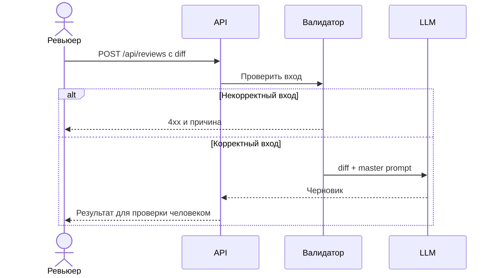

# Use cases и user stories

## Первый рабочий сценарий

**Когда** ревьюер отправляет diff одного PR, **система** проверяет вход и создаёт черновик ревью, **а пользователь получает** описание изменения, до трёх доказанных рисков и рекомендуемые проверки. Решение по PR остаётся у ревьюера.

Не входит: публикация комментариев в GitHub, автоматический approve/merge, изменение кода и анализ файлов вне diff.

## Use case UC-1: получить черновик ревью

| Поле | Значение |
|---|---|
| Актор | Ревьюер PR |
| Триггер | Отправка diff через POST /api/reviews |
| Предусловия | Текстовый diff одного PR в допустимом размере; сервис и модель доступны |
| Основной результат | Черновик с изменением, 0–3 рисками и проверками, который человек подтверждает или отклоняет; каждый показанный риск имеет проверяемую ссылку на новую строку diff |
| Ошибка или отказ | Отсутствующее/нестроковое/пустое поле diff → 4xx без вызова LLM; сбой LLM или непригодный ответ модели → контролируемая ошибка без выдуманного ревью |



## User stories и acceptance criteria

- Как ревьюер, я хочу видеть краткое описание изменения, чтобы понять его смысл до чтения деталей.
- Как ревьюер, я хочу видеть только замечания с местом и доказательством, чтобы быстро проверить их.
- Как ревьюер, я хочу получить понятную ошибку при неверном вводе, чтобы исправить запрос.

### Контракт черновика для проверки

Это **предлагаемый контракт будущего прототипа**, а не формат ответа существующего кода в [учебном diff](TRAINING_PR.diff). Текущий код возвращает только `{"comment": answer}`. Основание для будущего формата: [задание](README.md#задача-помощника), [Context Pack](context.md#формат-входа-и-результата) и [ADR-001](adr.md#решение).

| Поле черновика | Проверяемое правило | Негативный пример |
|---|---|---|
| Изменение | 1–2 предложения о добавленных действиях, без утверждений о невидимом коде | «Весь проект безопасен» |
| Риски | 0–3 пункта; для каждого: файл, номер строки **новой** версии, наблюдение из diff, возможное следствие с оговоркой и способ проверки | «Добавьте тесты» без места и входа |
| Проверки | Для каждого действия указан вход и ожидаемое наблюдение; статус — «предложено», пока тест не запускали | «Тест прошёл» при наличии только diff |
| Неопределённость | Если ссылка не подтверждается по diff, кандидат в риск исключается и причина сообщается ревьюеру; если ни один кандидат нельзя надёжно проверить, ответ помечается как непригодный для решения | Нулевой список рисков без объяснения после отбрасывания всех кандидатов |

**Хорошее замечание:** `app/api.py:10` — `payload["diff"]` обращается к обязательному ключу без проверки; для `{}` возникнет `KeyError`. Проверка: отправить `{}` на `POST /api/reviews` и проверить, что в будущем контракте сервис возвращает 4xx с указанием `diff` и не вызывает LLM. Строка и обращение видны в [TRAINING_PR.diff](TRAINING_PR.diff); ожидаемый 4xx — требование будущего сервиса, а не измеренный ответ текущего кода.

**Плохое замечание:** «API может работать плохо, добавьте обработку ошибок и тесты». Нет строки, причинной связи и наблюдаемого результата.

### Ошибки входа и результата

| Случай | Ожидаемое поведение будущего сервиса | Как подтвердить |
|---|---|---|
| Нет `diff`, тип не строка или строка пустая | 4xx с указанием поля; LLM не вызвана | HTTP-ответ и счётчик fake LLM |
| Размер превышает согласованный лимит на 1 байт | 4xx до вызова LLM; само значение лимита пока не утверждено | Граничный тест после утверждения лимита |
| LLM недоступна или вернула текст, который нельзя разобрать | Контролируемая ошибка; текст не выдаётся за черновик | Fake LLM возвращает исключение или неструктурированный текст |
| Один риск ссылается на отсутствующую в diff строку | Риск исключён, причина видна ревьюеру; остальные проверенные риски остаются | Fake LLM возвращает один корректный и один ложный риск |
| Все предложенные риски имеют неверные ссылки | Ответ обозначает неопределённость и не позволяет принять его за успешную проверку PR | Fake LLM возвращает только неверные ссылки |

Наличие строки в diff подтверждается автоматически; причинность замечания подтверждает человек. Точный JSON ответа, коды ошибок модели и лимит размера утверждаются до реализации. Нельзя выводить их из одного diff.

### Основания требований и открытые решения

| Утверждение в UC-1 | Основание | Статус |
|---|---|---|
| Один diff; описание, максимум три риска с доказательством и проверки | [Задание помощника](README.md#задача-помощника) | Правило учебного кейса |
| Решение по PR остаётся человеку; AI не approve/merge/edit | [Задание помощника](README.md#задача-помощника) | Правило учебного кейса |
| Текущий маршрут обращается к `payload["diff"]`, сервис возвращает `comment` | [TRAINING_PR.diff](TRAINING_PR.diff) | Наблюдение в diff, без запуска сервиса |
| Валидатор, структурированный ответ и проверка ссылок | [ADR-001](adr.md#решение) | Предложение для прототипа |
| Точный JSON, лимит размера и код сбоя модели | В разрешённых материалах отсутствуют | Открыто до согласования контракта |

```gherkin
Feature: Черновик ревью одного PR

  Scenario: Корректный учебный diff
    Given доступен сервис и текст TRAINING_PR.diff
    When ревьюер отправляет diff на POST /api/reviews
    Then он получает описание изменения и не более трёх рисков
    And каждый риск содержит файл, строку и проверяемое наблюдение
    And сервис не выполняет approve, merge или изменение кода

  Scenario: Поле diff отсутствует
    Given доступен сервис
    When ревьюер отправляет пустой JSON на POST /api/reviews
    Then он получает ответ 4xx с указанием поля diff
    And LLM не вызывается

  Scenario: Модель недоступна
    Given вход корректен, но LLM возвращает ошибку
    When ревьюер запрашивает ревью
    Then он получает контролируемую ошибку
    And ответ не выдаётся за завершённое ревью

  Scenario: Модель предложила риск для отсутствующей строки
    Given валидный diff и ответ fake LLM с корректным и неверным риском
    When ревьюер запрашивает черновик
    Then неверный риск не показан как доказанный
    And причина исключения видна ревьюеру
    And корректный риск содержит файл, строку и предлагаемую проверку
```

## Как использовали AI

- Для чего: превратить выбранный сценарий в проверяемые требования.
- Тип промпта: master prompting; [P1-03](prompts.md#журнал).
- Проверка: сценарии связаны с [анализом](analysis.md), [ADR](adr.md) и тестами; пользовательская оценка ещё не получена.
