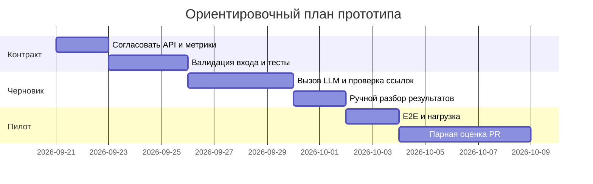

# План поставки

Это план **будущего учебного прототипа**, а не отчёт о реализации. Даты ориентировочные; роль владельца проекта пока не назначена.

## Инкременты и ответственность

| Инкремент | Наблюдаемый результат | Что делает человек | Что делает AI | Проверка | Зависимости |
|---|---|---|---|---|---|
| 1. Контракт входа | API принимает валидный diff; ошибки 4xx | Утверждает схему, лимит и ошибки | Предлагает случаи и черновик кода | Unit и integration для отсутствующего/неверного diff | Согласование API |
| 2. Черновик ревью | Описание, ≤3 риска с доказательствами, проверки | Проверяет выводы и принимает решение | Создаёт черновик по Context Pack | Парное ревью учебных и новых diff | Инкремент 1, доступ к LLM |
| 3. Пилот | Измерены время, доказательность, воспроизводимость и границы | Размечает ответы и решает о внедрении | Формирует ответы, не совершает действий с PR | Метрики из [problem.md](problem.md#метрики), E2E и нагрузка | Инкремент 2, выборка PR |

## Диаграмма Ганта

Критерий перехода между инкрементами: тесты соответствующего уровня проходят, а владелец решения принимает результаты. Если провайдер или данные пилота недоступны, фиксируем блокер и не объявляем метрики достигнутыми.

## Как использовали AI

- Для чего: связать инкременты с проверяемым результатом и ответственностью.
- Тип промпта: master prompting; [P1-03](prompts.md#журнал).
- Проверка: даты и роли отмечены как план, не как договорённость команды; оценка студента ожидается.
